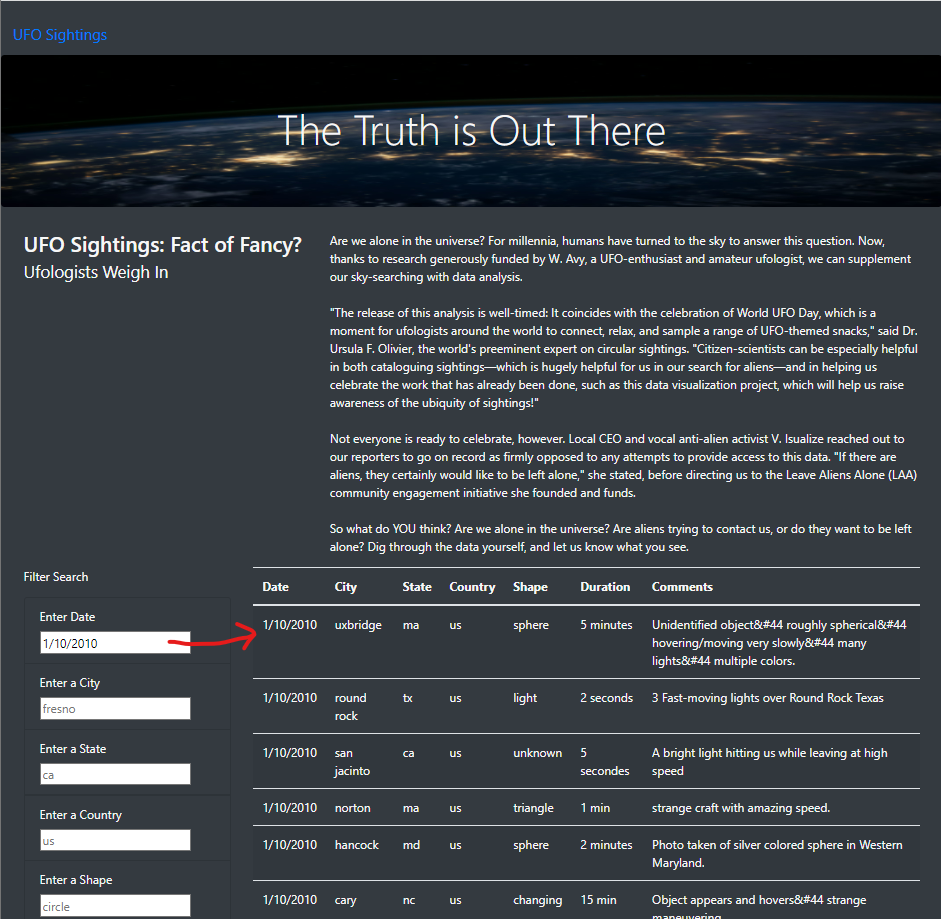

# UFOs
## Module 11 Challenge
## Overview
The purpose of this challenge was to enchance a website that was created to search UFO sightings by date.  It was requested to make the site also searchable by city, state, country, and shape.  Using JavaScrpit and HTML, the code in the website index.html and app.js files were modified to create more table filters as requested. The filter button was removed and functionality was added to allow the user to enter a free text request for data that would be returned when hitting the enter key. 

The refactored code is available via the following links:

https://github.com/MaureenHubka/UFOs/blob/main/app.js

https://github.com/MaureenHubka/UFOs/blob/main/index.html

## Results
The website is now searchable by date, city, state, country, and shape by entering the desired data in the filter search and hitting the enter key. 

## Summary

One draw back of the UFO website is the need to free text the requested data. A dropdown menu with avaiable responses would be easier for the user to see what options are available. This would also prevent spelling errors that can limit search response.

I would also recommend not to use the defaulted grey sample criteria in the search filter boxes.  This caused me confusion as to whether the information was already there or not.  I would put an example of the format required above the search box, if needed. I would also move the "UFO Sightings" tab at the upper left corner, that resets the data display, closer to the Filter Search.  Being able to create charts with trends and comparisons would make a great addition to the site. 

